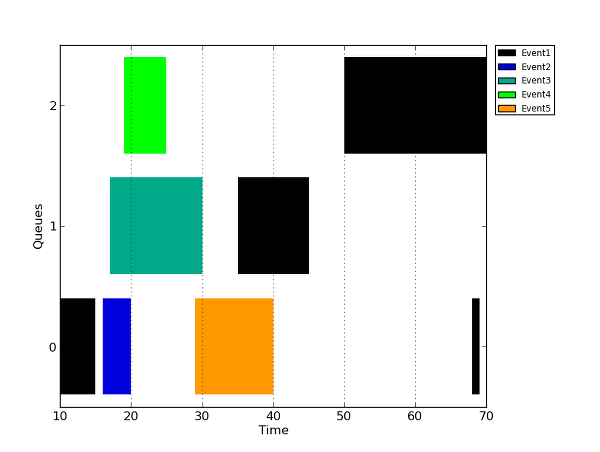

Technical aspects
=================

_cf4ocl_ is divided into four parts: i) library; ii) command-line 
utilities; iii) unit tests; and, iv) examples. Part i), the library, 
offers functions which aim to achieve goals 1 and 2. The command-line 
utilities, part ii), are focused on goal 3. The unit tests, part
iii), aim to verify that the library functions are working properly. 
Finally, the examples show how to integrate the library functions in 
fully working OpenCL programs.

_cf4ocl_ works in Linux, Windows and Mac OSX, although, being pure 
C99, it should compile on other platforms, as long as the dependencies, 
[GLib][] and [OpenCL][], are met. The reference compiler is GCC with 
`-Wall` and `-Wextra` flags activated. The code is verified with 
[valgrind][] and is fully commented. API documentation can be generated 
with [Doxygen][] via `make`.


Introduction
============

_cf4ocl_ is divided into four parts, with the following structure:

1. Library
    * CL Utils
    * CL Profiler
    * CL Errors
    * GError framework
2. Library tests
    * CL Profiler
    * GError framework
3. Utilities
    * Device query
    * Kernel info
4. Examples
    * Bank conflicts test
    * Matrix multiplication

The following sections describe each of the parts in additional detail.

Library
-------

The library offers functions which promote the rapid development of 
OpenCL C programs, _CL Utils_, as well as their detailed benchmarking,
_CL Profiler_. The library also facilitates error management in two
ways: i) by converting OpenCL error codes into human readable strings, 
_CL Errors_; ii) by exposing a generic error handling framework,
_GError framework_, used internally by _CL Utils_ and _CL Profiler_.

### CL Utils

The _CL Utils_ section of the library allows the initialization of 
OpenCL environment objects, such as platform, device, context, 
command queues and devices, with a single function, `cl4_man_zone_new`, thus
avoiding the typical boilerplate code required for this setup. Device
selection is decoupled from the OpenCL environment setup, being 
performed with a function passed as a parameter to `cl4_man_zone_new`. The
library supplies functions to accomplish this task automatically or 
through user interaction, although the client programmer can supply its
own function with the required selection criteria. The destruction of 
the OpenCL environment, i.e. the removal of the respective objects from 
memory, is also achieved with one function, namely `cl4_man_zone_free`.

Kernel compilation is simplified by the `cl4_man_program_create` function,
which can be used to build OpenCL device programs by passing an array of 
filenames containing kernel code.

The data structures in _CL Utils_ are completely transparent to the
client programmer, allowing access the underlying OpenCL objects at all 
times.

### CL Profiler

The functions in _CL Profiler_ allow the client programmer to obtain
detailed profiling information about OpenCL functions for kernel 
execution and host-device memory transfers, including relative and 
absolute execution times. Profiling information is obtained using
OpenCL events, which can be associated with the relevant OpenCL 
functions. _CL Profiler_ supports multiple command queues and 
overlapping events, such as simultaneous kernel executions and data 
transfers. Profiling information can be exported in a configurable
format, and plotted using a script included in _cf4ocl_.

### CL Errors

_CL Errors_ offers a single function which converts a OpenCL error into
a human readable string.

### GError framework

The _GError framework_ is internally used by _CL Utils_ and 
_CL Profiler_ for error handling purposes. However, the framework is not
in any way tied to OpenCL, so it can be used generically in any C 
program. It is composed of three macros and it is based on the 
`GError` object from GLib.

Utilities
---------

### Device query

Simple implementation of a program for querying available OpenCL
platforms and devices with clean and useful output.

### Kernel info

The `kernel_info` program performs static analysis of OpenCL kernels.

How to use _cf4ocl_
===================

Dependencies
------------

In order to compile _cf4ocl_ and use it in projects, two dependencies are
required: 1) [OpenCL][]; and, 2) [GLib][] (v2.32 or newer).

### OpenCL

The OpenCL headers (for compiling) and shared library (for linking) can
be installed from the packages offered by different OpenCL vendors such
as [AMD][AMDSDK], [Intel][IntelSDK] or [Nvidia][NvidiaSDK]. 

Alternatively, it is possible to install an OpenCL development 
environment in a some recent Linux distributions. For example, in Debian
7 and Ubuntu 13.04:

    $ sudo apt-get install ocl-icd-opencl-dev

This will install the headers and shared library system-wide, avoiding 
the need to specify their location to GCC. However, to actually run an 
OpenCL program it is necessary to have a vendor implementation 
installed.

### GLib

The simplest way to install [GLib][] on Linux is through the package 
manager of the respective distribution. For Debian and Ubuntu:

    $ sudo apt-get install libglib2.0-dev
    
It is also advisable to install the `libglib2.0-0-dbg` or equivalent
package to allow debugging at the GLib level.

This [tutorial](http://www.gtk.org/download/win32_tutorial.php) explains
how to install GLib in Windows.

Download, build and install
---------------------------

_cf4ocl_ uses the [CMake][] build system. Assuming a working development 
environment with GCC and CMake installed, and the dependencies (OpenCL
and GLib) properly setup, either clone or download and extract _cf4ocl_ 
into a location of your preference. The _cf4ocl_ directory tree will 
have the following structure:

    cf4ocl/
    |
    +-- cmake
    |   |
    |   +-- Modules
    |
    +-- images
    |
    +-- scripts
    |
    +-- src
        |
        +-- examples
        |
        +-- lib
        |
        +-- tests
        |
        +-- utils

Within the _cf4ocl_ directory, create a folder named `build`. This is
where the project will be built, such that the contents of the _cf4ocl_ 
folder (source code, scripts, etc.), are kept separate from the build 
files. 

Next, `cd` into the `build` folder and run the `cmake ..` command. If
OpenCL and GLib are successfully found by CMake, the Makefiles required
for building and installing _cf4ocl_ are created. If an error occurrs,
it might be necessary to manually provide the location of these
dependencies. In order to do so, run the `ccmake ..` command, which
offers a configuration interface for this purpose. Alternatively, run
the CMake GUI, chose the _cf4ocl_ directory as the source code 
location and the `build` directory as the place where to build the
binaries. Specify the library and include locations for OpenCL and 
GLib, click "Configure", then "Generate". The makefiles should now have 
been generated.

In order to build the project, run `make` in the `build` folder. 
Project installation can be accomplished with `make install`. By 
default, _cf4ocl_ is installed system wide, which requires the later
command to be executed as root or administrator (e.g. using `sudo` in
Linux, or an elevated priviledge command prompt on Windows). The
install location can be changed with the `ccmake` command, or with the
CMake GUI. The tests can be compiled separately with `make tests`.

After installation, the _cf4ocl_ shared library should be registered
with `ldconfig` (Linux) or `regsvr32` (Windows), such that client
applications can find it at runtime.

The API documentation can be generated with `make` if [Doxygen][] 
(version 1.8.3 or newer) is installed. In the _cf4ocl_ directory run:

    $ make doc
    
The documentation will be generated in the `./doc` folder. The direct
use of the `doxygen` command should be avoided because 
[Doxygen's markdown][doxymd] is not 100% compatible with the 
[GitHub Flavored Markdown][ghmd] used in this document. When building 
the documentation with `make`, the required conversion is performed 
first.

Using the library in a new project
----------------------------------

Any of the three elements of the library can be used in a workflow
without the need to use the others. However, both CL Utils and CL 
Profiler internally use the GError framework. The _cf4ocl_ header
includes all the definitions for the three elements of the library. This
header can be included as follows:

```c
#include <cf4ocl.h>
```

### Compiling and linking

#### CMake

If client code uses CMake as its build system, then it is very simple
to integrate _cf4ocl_. Add the following lines to your CMakeLists.txt
file:

```
# Find required libraries
find_package(PkgConfig REQUIRED)
find_package(Cf4ocl REQUIRED)
pkg_check_modules(GLIB REQUIRED glib-2.0>=2.32.1)

# Library include directories
include_directories(${GLIB_INCLUDE_DIRS} ${CF4OCL_INCLUDE_DIRS})
```

_cf4ocl_ can be found by CMake through a module included in the project
for this purpose. Take a look at the [CL-Ops](https://github.com/FakenMC/cl-ops/)
project for an example on how to do so.

#### GNU Make

##### Compiling

Depending on how _cf4ocl_ was installed, it may be necessary to specify 
the location of the _cf4ocl_ header with the `-I` flag. The same is true
for the GLib and OpenCL headers, which are included by the _cf4ocl_
header. For GLib, instead of directly specifying the header location,
it is also possible to use PkgConfig instead:

    `pkg-config --cflags glib-2.0`

##### Linking

It is necessary to specify the use of the _cf4ocl_ with the `-l` flag,
e.g.:

    -lcf4ocl
    
Again, depending on how _cf4ocl_ was installed, it may be necessary to 
specify the location of the _cf4ocl_ shared library with the `-L` flag. 

### Using CL Utils

The functions provided by CL Utils aim to facilitate the rapid 
development and deployment of C programs which use OpenCL. These 
functions are focused on two key tasks:

1. Setup and tear down of the OpenCL environment, including device,
context and command queues.

2. Loading, compilation and tear down of OpenCL kernel programs.

These two tasks require very verbose code, with significant repetition 
between projects. CL Utils wraps these tasks into two functions,
providing an additional third function for freeing up the allocated
resources. The OpenCL objects created by CL Utils are available to
the client programmer at all times through the `CLUZone` object. 
CL Utils does not wrap any other OpenCL tasks, such as kernel execution 
or data transfers, which can be performed directly with the respective 
OpenCL functions.

The first task is performed with the `cl4_man_zone_new` function, which
has the following prototype:

```c
CLUZone* cl4_man_zone_new(
    /* Type of device, e.g. CL_DEVICE_TYPE_CPU, CL_DEVICE_TYPE_GPU, etc. */
    cl_uint deviceType,
    /* Number of command queues. */
    cl_uint numQueues,
    /* Command queue properties, e.g. CL_QUEUE_PROFILING_ENABLE, etc. */
    cl_int queueProperties,
    /* Pointer to a device selector function. */
    cl4_man_device_selector devSel, 
    /* Extra arguments for device selector function. */
    void* dsExtraArg, 
    /* GLib's error reporting object (may be ignored). */
    GError **err
);
```

The returned `CLUZone` object will contain the context, command queues,
device information and an uninitialized kernel program. The program is
initialized with the `cl4_man_program_create` function as part of the second 
task. This function has the following prototype:

```c
cl_int cl4_man_program_create(
    /* The CLUZone object return by the cl4_man_zone_new function. */
    CLUZone* zone, 
    /* List of files containing the source code for the kernels. */
    const char** kernelFiles, 
    /* Number of kernel files given in the previous parameter. */
    cl_uint numKernelFiles, 
    /* Compiler options. */
    const char* compilerOpts, 
    /* GLib's error reporting object (may be ignored). */
    GError **err
);
```

A typical usage pattern of CL Utils in a C program:

```c
include "clutils.h"

...

int main(int argc, char* argv[]) 
{
    ...
    CLUZone* zone = NULL;
    const char* oclSources[] = {"src1.cl", "src2.cl", "moresrc.cl"};
    ...

    /* Get a complete OpenCL environment using a GPU device, one  */
    /* command queue, no command queue options, if more than one  */ 
    /* GPU is available show selection menu to user, and ignore   */
    /* error reporting. */
    zone = cl4_man_zone_new(CL_DEVICE_TYPE_GPU, 1, 0, cl4_man_menu_device_selector, NULL, NULL);
    ...

    /* Create (compile) an OpenCL kernel program using three OpenCL */
    /* source files, no compiler options, and ignoring error        */
    /* reporting.                                                   */
    status = cl4_man_program_create(zone, oclSources, 3, NULL, NULL);
    ...

    /* Perform OpenCL tasks such as data transfer and kernel execution */
    /* using the OpenCL objects (queues, program, context, etc.)       */
    /* available within the CLUZone object.                            */
    ...

    /* Free the CLUZone object and all of the contained OpenCL objects.*/
    /* This object should only be released after all OpenCL objects    */
    /* not controlled by CL Utils (kernels, events, memory objects)    */
    /* are released.                                                   */
    cl4_man_zone_free(zone);

    ...

}
```

The fourth parameter of `cl4_man_zone_new` is a pointer to a device 
selector function, which has the following definition:

```c
typedef cl_uint (*cl4_man_device_selector)(
    /* Array of available devices and respective information. */
    CLUDeviceInfo* devInfos,
    /* Number of devices in array. */
    cl_uint numDevices, 
    /* Extra arguments to selector function. */
    void* extraArg
);
```

CL Utils provides two ready to use device selector functions:

* `cl4_man_menu_device_selector` - If more than one device exists, presents
a selection menu to the user. If extra argument is given it should be 
the array index of the preferred device.
* `cl4_man_info_device_selector` - Selects a device by device name, device
vendor and/or platform name, any/all of which are given in the extra
argument.

For other device selection requirements, the client programmer can 
develop a specific device selector function.

### Using CL Profiler

The goal of CL Profiler is to provide detailed benchmarking information 
about OpenCL events such as kernel execution, data transfers, and so on.
CL Profiler is prepared to handle overlapping events, which usually
take place when the programmer is trying to optimize its application
by simultaneously transfer data to and from the OpenCL device and 
execute kernels, using different command queues.

CL Profiler consists of two files, `clprofiler.c` and `clprofiler.h`.
In order to use CL Profiler in a project, it is necessary to include
the `clprofiler.h` header file.

For the purpose of this explanation, we will consider that two command 
queues are being used:

```c
cl_command_queue queue0; /* Used for host-device data transfer. */
cl_command_queue queue1; /* Used for kernel execution. */
```

Additionally, we will consider the following OpenCL events:

```c
cl_event ev_transf_in;  /* Transfer data from host to device. */
cl_event ev_kernel_A_1; /* Execute kernel A on device. */
cl_event ev_kernel_B;   /* Execute kernel B on device. */
cl_event ev_kernel_A_2; /* Execute kernel A on device again. */
cl_event ev_transf_out; /* Transfer data from device to host. */
```

The `ProfCLProfile` structure forms the basis of CL Profiler. It can:
1) measure the total elapsed time of the application (or the relevant 
part of the application); and, 2) keep track of the device time required
by the OpenCL events. The following instruction creates a new 
`ProfCLProfile` structure:

```c
/* Create a new ProfCLProfile structure. */
ProfCLProfile* profile = profcl_profile_new();
```

In order to start measuring the relevant part of the application, the
following instruction should be issued:

```c
/* Start basic timming / profiling. */
profcl_profile_start(profile);
```

At this time, the typical OpenCL application workflow, such as 
transferring data and executing kernels, should take place. The above 
defined events must be associated with the respective `clEnqueue*` 
OpenCL functions in order to be later analyzed. A typical workflow 
may be finalized with the following instructions:

```c
/* Finish all pending OpenCL operations. */
clFinish(queue0);
clFinish(queue1);
```

Profiling should be stopped at this point.

```c
profcl_profile_stop(profile); 
```

Now the events can be added to the profiler structure. The
`profcl_profile_add` function uses the second parameter (a string)
as a key to differentiate between events. Thus, if the same key
is given for different OpenCL events, CL Profiler will consider 
it to be the same _semantic_ event. This can be useful for aggregating
execution times of events which occur innumerous times in a cyclic 
fashion (in a _for_ loop, for example). 

```c
/* Add events to be profiled/analyzed. */
profcl_profile_add(profile, "Transfer data to device", ev_transf_in, NULL);
profcl_profile_add(profile, "Kernel A", ev_kernel_A_1, NULL);
profcl_profile_add(profile, "Kernel B", ev_kernel_B, NULL);
profcl_profile_add(profile, "Kernel A", ev_kernel_A_2, NULL);
profcl_profile_add(profile, "Transfer data from device", ev_transf_out, NULL);
```

The above code will consider OpenCL events `ev_kernel_A_1` and `ev_kernel_A_2`
to be the same semantic event because the same key, string _Kernel A_, is
used. Thus, the total execution time for the semantic event _Kernel A_ will 
be the sum of respective two OpenCL events. CL Profiler can even
determine overlaps of a semantic event with itself (i.e., two overlapping
OpenCL events which are added for analysis with the same key).

After all the events are added, it is necessary to instruct CL 
Profiler to perform the required calculations in order to determine
the absolute and relative times of all events, and how these correlate
with the total elapsed time of the relevant part of the application.

```c
profcl_profile_aggregate(profile, NULL);
```

Finally, the complete benchmarking info can be printed:

```c
profcl_print_info(profile, PROFCL_AGGEVDATA_SORT_TIME, NULL);
```

Two detailed tables will be shown on screen: one for individual events 
(sorted by name or execution time), and another showing event overlaps, 
if any occurred.

A list of all events can be exported to a file or stream using the 
`profcl_export_info*` functions. 

```c
profcl_export_info_file(profile, "profileinfo.txt", NULL);
```
Export options, such as field delimiters, field separators, and so on, 
can be set using the `profcl_export_opts_set()` function. 

A Gantt chart type graph can be produced from the exported file (using
the default options) via a Python script included with _cf4ocl_:

`$ python plot_events.py profileinfo.txt`



A similar plot can also be produced with [gnuplot] using the [gantt.py]
script.

The OpenCL events can be freed after they have been added to the 
profiler structure and before the program terminates.

```c
clReleaseEvent(ev_transf_in);
clReleaseEvent(ev_kernel_A_1);
clReleaseEvent(ev_kernel_B);
clReleaseEvent(ev_kernel_A_2);
clReleaseEvent(ev_transf_out);
```

The last parameter of some of the `profcl_*` functions is used for error 
handling and to obtain detailed error messages if an error occurs. By 
passing `NULL`, the programmer choses to ignore that feature. Such approach 
is not critical because all of the error-prone `profcl_*` functions also return
their execution status code. No error handling is performed in this 
explanation, though.

For map events, CL Profiler provides the `profcl_profile_add_composite()`
function, which accepts two OpenCL events, one relative to the _map_
operation, and the other to the _unmap_ operation. The function uses
the start instant of the _map_ event, and the _end_ instant of the
_unmap_ event, in order to build a composite semantic event.

### Using CL Errors

OpenCL functions usually return an error or status code, so that the
client programmer can check if the function call was successful, and if
not, what kind of problem occurred. The programmer can either check for 
all possible errors for a given function call using the OpenCL error
constants (which map the error codes), or can just return or print the 
error code, and then look at the [cl.h] header to determine what error
occurred. _CL Errors_ allows for a third option: convert the error code
into a human readable string. The usage is very simple, consisting of
a single call to the `cl4_err()` function, passing the error code
as an argument:

```c
cl_int status;
...
status = clFinish(some_command_queue);
if (status != CL_SUCCESS) {
	printf("An error occurred: %s\n", cl4_err(status));
	...
}
...
```
### Using GError Framework (GErrorF)

The main purpose of GErrorF is to provide error handling constructs to 
CL Utils and CL Profiler. No knowledge of GErrorF is required to use
CL Utils and/or CL Profiler. However, because it is sufficiently generic 
to be used in any C application, a specific description is warranted.

GErrorF uses GLib's `GError` object for function error reporting. This
explanation assumes some familiarity with 
[GLib's error reporting][gliberror].

GErrorF is defined by three macros in `error_handling.h`:

* `gef_if_error_create_goto` - Catches errors from non-GError aware
functions.
* `gef_if_error_goto` - Catches errors from GError aware functions.
* `gef_if_error_propagate_goto` - Same as previous macro, but propagates 
error in a source GError object to a new destination GError object.
Useful for wrapping errors thrown by library / third-party GError aware
functions.

GErrorF establishes an error handling methodology for C programs not
entirely dissimilar to the pattern used in Linux kernel development. 
Any function producing recoverable runtime errors, from `main` to 
functions located deeper in the call stack, can benefit from this 
approach. The general usage of GErrorF is as follows:

```c
include "error_handling.h";

...

int main(int argc, char* argv[]) 
{

    ...

    /* Must initialize every allocable pointers and objects */
    /* to NULL.                                             */
    int some_vector* = NULL;

    /* GError object. */
    GError *err = NULL;

    /* Function return status. */
    int status = SUCCESS_CODE;

    ...

    /* Call a GError aware function (defined bellow). */
    some_function(params, &err);

    /* Catch possible error in GError-aware function. In this */
    /* case the GError object is initialized by the called    */
    /* function.                                              */
    gef_if_error_goto(
        err,              /* GError object. */
        SOME_ERROR_CODE,  /* Error code to set in status. */
        status,           /* Function return status. */
        error_handler     /* Label to goto in case of error. */
    );

    /* In the previous function it is possible to replace an app */
    /* specific error code with GErrorF special constants        */
    /* GEF_USE_STATUS and GEF_USE_GERROR. The former leaves the  */
    /* status variable untouched (useful for cases where the     */
    /* function itself returns a usable int status), while the   */
    /* later sets status to the error code set in the GError     */
    /* object. */

    ...

    /* Call a non-GError aware function. */
    some_vector = (int*) malloc(sizeof(int) * SOME_SIZE);

    /* Catch possible error in non-GError aware function. */
    gef_if_error_create_goto(
        err,                    /* GError object.                  */
        SOME_QUARK_ERROR,       /* GLib GQuark identifier.         */
        some_vector == NULL,    /* Error condition.                */
        SOME_ERROR_CODE,        /* Error code to set in err.       */
        error_handler,          /* Label to goto in case of error. */
        "Unable to alloc. mem." /* Error msg to set in err.        */
    );

    ...

    /* If we get here, there was no error, goto cleanup. */
    g_assert(err == NULL);  /* Make sure err is NULL. */
    goto cleanup;           /* Goto the cleanup section. */
	
error_handler:
    /* If we got here there was an error, verify that it is so. */
    g_assert(err != NULL);
    /* Print error message. */
    fprintf(stderr, "Error message: %s\n", err->message);
    /* Make sure function status contains an error code. */
    if (status == SUCCESS_CODE) status = err->code; 
    /* Free the GError object. */
    g_error_free(err);

cleanup:	
    /* Free any allocated memory. */
    if (some_vector) free(some_vector);

    ...

    /* Return program status. */
    return status;
}

...

/* This function is GError-aware, and will initialize the GError */
/* object if an error occurs. The GError object usually comes    */
/* as the last parameter.                                        */
void some_function(some params, GError** err) 
{

    ...

    FILE* fp;
    const char* filename = "somefile.txt";

    ...

    /* Try to open a file. This function is not GError aware. */
    fp = fopen(filename, "r");

    /* Catch possible error in non-GError aware function. */
    gef_if_error_create_goto(
        *err,                     /* GError object.                  */
        SOME_QUARK_ERROR,         /* GLib GQuark identifier.         */
        fp == NULL,               /* Error condition.                */
        SOME_ERROR_CODE,          /* Error code to set in err.       */
        error_handler,            /* Label to goto in case of error. */
        "Unable to open file %s", /* Error msg to set in err.        */
        filename                  /* Extra args for error msg.       */
    );

    ...

    /* If we got here, everything is OK.                          */
    /* It's good practice to check if err is NULL (caller doesn't */
    /* care about error reporting OR if a non-null err is         */
    /* pointing to NULL (i.e. no error was reported).             */
    g_assert(err == NULL || *err == NULL);

    /* Goto finish label, ignoring the error handling section.    */
    goto finish;

error_handler:
    /* If we got here there was an error, verify that it is so,   */
    /* i.e. either the caller doesn't care about error reporting, */
    /* in which case err is NULL, OR a non-null err is in fact    */
    /* pointing to an initialized GError object.                  */
    g_assert(err == NULL || *err != NULL);

    /* Run any other error handling code. */
    ...

finish:	

    /* Close the file, if open. */
    if (fp) fclose(fp);

    /* Perform additional required cleanup (free's and so on). */
    ...
    
    /* Bye. */
    return;

}

```

As can be observed, GErrorF enforces a strict programming pattern, 
which requires that complying functions follow a set of rules:

* Define all pointers and objects in the beginning of the function 
and initialize them to NULL.
* Define a pointer to a GError object and set it to NULL.
* Always test for errors after calls to error throwing functions
with `gef_if_error_create_goto` (non-GError aware functions) or
`gef_if_error_goto` (GError aware functions). If an error occurs
program execution will jump to the error handling block.
* Use the following pattern at the end of the function:
    * goto cleanup
    * error handling block
    * cleanup: perform clean up
    * return (possibly with a status code)

This pattern avoids many bugs and makes error catching and handling
possible in C. However it is not to everyone's taste, and is thus
a completely optional aspect of _cf4ocl_.

Other useful C frameworks/utilities for OpenCL
==============================================

If _cf4ocl_ does not meet your requirements, take a look at the following
projects:

* [Simple OpenCL][]
* [The OpenCL utility library][]
* [Computing Language Utility][]
* [OCL-MLA][]

<!---
Conclusions
References
Appendices
-->

[GLib]: https://developer.gnome.org/glib/ "GLib"
[OpenCL]: http://www.khronos.org/opencl/ "OpenCL"
[Doxygen]: http://www.doxygen.org/‎ "Doxygen"
[cppcheck]: http://cppcheck.sourceforge.net/ "cppcheck"
[LGPLv3]: http://www.gnu.org/licenses/lgpl.html) "LGPLv3"
[GPLv3]: http://www.gnu.org/licenses/gpl.html "GPLv3"
[AMDSDK]: http://developer.amd.com/tools-and-sdks/heterogeneous-computing/amd-accelerated-parallel-processing-app-sdk/ "AMD"
[IntelSDK]: http://software.intel.com/en-us/vcsource/tools/opencl-sdk "Intel"
[NvidiaSDK]: https://developer.nvidia.com/category/zone/cuda-zone "Nvidia"
[clheaders]: http://www.khronos.org/registry/cl/ "Khronos"
[markdown]: http://daringfireball.net/projects/markdown/ "Markdown"
[doxymd]: http://www.stack.nl/~dimitri/doxygen/manual/markdown.html "Doxygen Markdown"
[ghmd]: https://help.github.com/articles/github-flavored-markdown "Github Flavored Markdown"
[gliberror]: https://developer.gnome.org/glib/2.32/glib-Error-Reporting.html "GLib Error Reporting"
[gnuplot]: http://www.gnuplot.info/
[gantt.py]: http://se.wtb.tue.nl/sewiki/wonham/gantt.py
[cl.h]: http://www.khronos.org/registry/cl/api/1.2/cl.h
[CMake]: http://www.cmake.org/

[Simple OpenCL]: http://code.google.com/p/simple-opencl/ "Simple OpenCL"
[The OpenCL utility library]: https://github.com/Oblomov/CLU "The OpenCL utility library"
[Computing Language Utility]: https://github.com/Computing-Language-Utility/CLU "Computing Language Utility"
[OCL-MLA]: http://tuxfan.github.io/ocl-mla/ "OCL-MLA"


